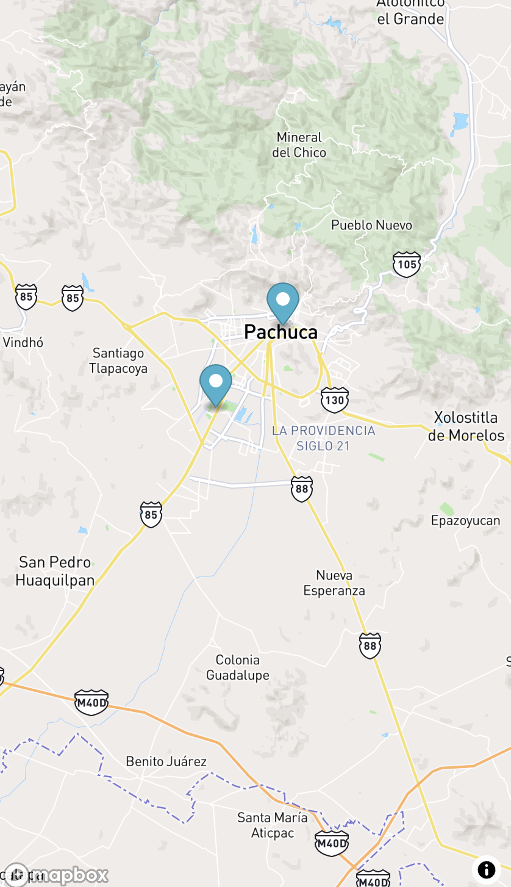

# Air Quality Index

## Description
Brief description of the project, its purpose, and main functionalities.

## Check Application Online
- [AirQuality](https://airquality-miguel-jardinez.vercel.app/)


## Technologies Used
- **UI**:
    - [Chakra UI](https://chakra-ui.com/)
    - [Chakra UI Icons](https://chakra-ui.com/docs/media-and-icons/icon)
    - [Lottie](https://airbnb.io/lottie/#/)
    - [Mapbox](https://www.mapbox.com/)
    - [Chart.js](https://www.chartjs.org/)
- **Backend**:
    - [Next.js](https://nextjs.org/)
- **Date and Time**:
    - [Day.js](https://day.js.org/)
- **Frontend Framework**:
    - [Next.js](https://nextjs.org/)
- **Code Standardization**:
    - [ESLint](https://eslint.org/)
    - [Husky](https://typicode.github.io/husky/#/)
- **Monitoring**:
    - [SonarCloud](https://sonarcloud.io/)
- **Testing**:
    - [Jest](https://jestjs.io/)
    - [React Testing Library](https://testing-library.com/docs/react-testing-library/intro/)
- **Deployment**:
    - [GitHub Actions](https://github.com/features/actions)
- **Versioning**:
    - [Changelog CLI](https://changelog.md/cli/)

|                      Main                       |                      Chart                       |                      Details                       |
|:-----------------------------------------------:|:------------------------------------------------:|:--------------------------------------------------:|
|  |  |  |

|                      Information                       |                      maps                       |                   No Sensor near                   |
|:------------------------------------------------------:|:-----------------------------------------------:|:--------------------------------------------------:|
|  |  |  |

|                      Error Page                       |
|:-----------------------------------------------------:|
|  |

## Development Process
### Code Standardization
- We use ESLint to maintain clean and consistent code.
- Husky helps us run scripts on commits to ensure coding standards are adhered to.

### Monitoring and Testing
- SonarCloud is used for code quality monitoring.
- Jest is used for running unit tests.
- React Testing Library is used for testing React components.

### Deployment
- GitHub Actions is used to automate the deployment process.
    - Actions are triggered on the develop branch to deploy to staging.
    - Pull requests trigger linting checks and code coverage.
    - Pushes to main branch are checked for linting, coverage, and deployed to production.

## Installation
1. Clone this repository.
2. Install dependencies using yarn:

````
yarn install
````
````
yarn dev
````


## Usage
put the correct value in the .env
````
API_KEY=
NEXT_PUBLIC_MAPBOX_ACCESS_TOKEN=
````
after run
````
yarn dev
````

## API Endpoints

#### GET /location

Returns information about all locations.

**Query Parameters:**
- `coords`: string (Example: "1,1"). Coordinates to filter nearby locations.

---

#### GET /location/{id}

Returns information about a specific location.

**Path Parameters:**
- `id`: string. Unique identifier of the location.

---

#### GET /measure/{id}/measurements

Returns measurements associated with a specific location.

**Path Parameters:**
- `id`: string. Unique identifier of the location.

**Query Parameters:**
- `period_name`: string. Name of the time period for the measurements.
- `limit`: number. Limit of measurements to return.
- `parameters_id`: string. Unique identifier of the parameter to measure.
- `date_from`: date. Start date of the time interval for the measurements.
- `date_to`: date. End date of the time interval for the measurements.

---

## Contribution
If you wish to contribute to this project, follow these steps:
1. Fork the repository.
2. Create a new branch (`git checkout -b feature/new-feature`).
3. Make your changes and commit (`git commit -am 'Add new feature'`).
4. Push to the branch (`git push origin feature/new-feature`).
5. Create a new Pull Request.

## License
This project is licensed under the [MIT License](https://opensource.org/licenses/MIT).
